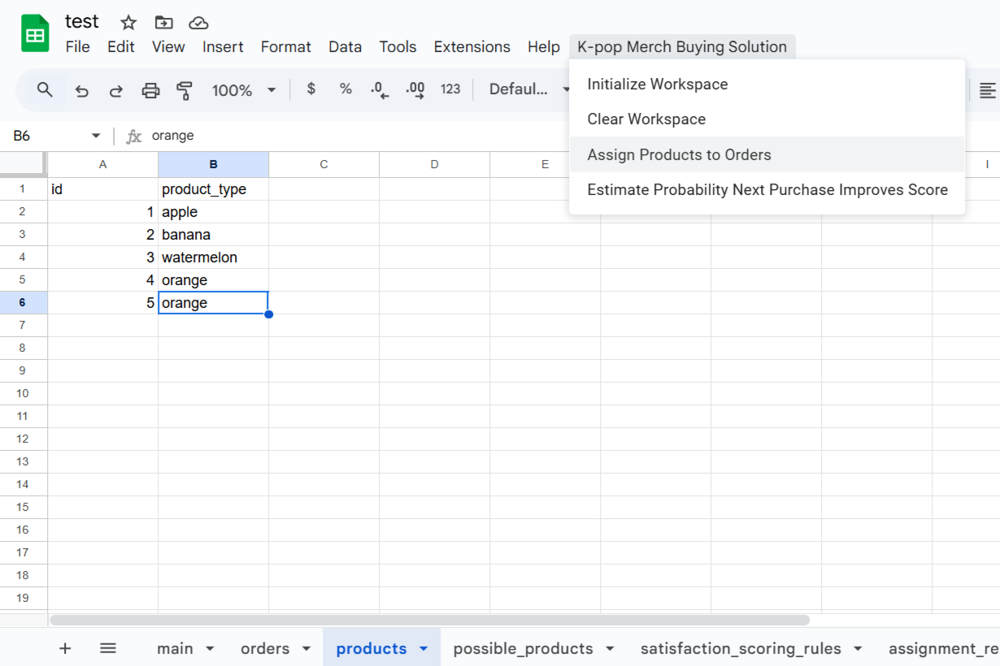

# 🎤​ K-pop Merch Buying Solution

A Google Sheets-based solution to help K-pop merch buyers scale their businesses and improve customer satisfaction by optimizing product allocation and purchase decisions using probability and assignment logic.

---

## 📌 Table of Contents

- [📖 Background](#-background)
- [🚨 Business Problem](#-business-problem)
- [💡 The Solution](#-the-solution)
- [🚀 Getting Started](#-getting-started)
  - [Step 1: Create a Google Spreadsheet](#step-1-create-a-google-spreadsheet)
  - [Step 2: Open App Script](#step-2-open-app-script)
  - [Step 3: Configure the Project](#step-3-configure-the-project)
  - [Step 4: Copy the Script Code](#step-4-copy-the-script-code)
  - [Step 5: Initialize the Workspace](#step-5-initialize-the-workspace)
  - [Step 6: Add Possible Products](#step-6-add-possible-products)
  - [Step 7: Add Orders](#step-7-add-orders)
  - [Step 8: Add Purchased Products](#step-8-add-purchased-products)
  - [Step 9: Assign Products to Orders](#step-9-assign-products-to-orders)
  - [Step 10: Check Satisfaction Score](#step-10-check-satisfaction-score)
  - [Step 11: Estimate Next Purchase Probability](#step-11-estimate-next-purchase-probability)
  - [Step 12 (Optional): Add More Purchases](#step-12-optional-add-more-purchases)
  - [Step 13: Re-run Assignments and Estimations](#step-13-re-run-assignments-and-estimations)
  - [Step 14: Reset the Workspace](#step-14-reset-the-workspace)
- [📈 What's Next](#-whats-next)

## 📖 Background

K-pop's global rise has brought with it a surge in demand for exclusive, limited-edition merchandise. However, many of these items are only available in South Korea, giving rise to a new type of professions: the **K-pop merch buyer**.

These individuals help international fans get merch, acting as middlemen who purchase and ship products overseas. One major challenge they face is the **mystery box** nature of most merch — buyers don't know what they’re getting until after the purchase.

## 🚨 Business Problem

1. **Mystery Box Merch**: Items are sold randomly (e.g., photo cards of different group members).
2. **Uncertain Fulfillment**: Buyers allow customers to list multiple preferred items, but matching these efficiently is difficult.
3. **Inefficient Allocation**: Time-consuming manual assignment of products to orders.
4. **Cost Dilemma**: Whether or not to buy another mystery box is a gamble.

## 💡 The Solution

This tool offers two key features to solve the problems above:

- ✅ **One-click product assignment**: Match available products to customer preferences optimally.
- 📊 **Purchase probability estimation**: Estimate the probability that buying one more mystery box will improve total customer satisfaction.

---

## 🚀 Getting Started

### Step 1: Create a Google Spreadsheet

Create a new Google Sheet with your account.

### Step 2: Open App Script

From your Sheet: Click `Extensions` → `Apps Script`

### Step 3: Configure the Project

You will need to configure the project for it to work. To do so, follow this guide:

[Fix "This app is blocked" error](https://web.archive.org/web/20230207010146/https://aimanfikri.com/2022/05/09/this-app-is-blocked-error-on-google-apps-script-solution/)

*If the project is not configured, you may see "Authorization Required" when running functions.*

### Step 4: Copy the Script Code

Copy the script code in `Code.gs` in this repository and paste it in the `Code.gs` of your project.

### Step 5: Initialize the Workspace

1. Refresh your sheet.
2. Go to the new menu: **`K-pop Merch Buying Solution`** → **`Initialize Workspace`**
3. Enter the number of picks (1–10) each customer can select.

This will create 6 sheets:

- `main`
- `orders`
- `products`
- `possible_products`
- `satisfaction_scoring_rules`
- `assignment_result`

### Step 6: Add Possible Products

In `possible_products`, list every potential merch outcome.

Example: apple, banana, orange, grapes, strawberry, watermelon, pineapple

### Step 7: Add Orders

In the `orders` sheet, fill in your customer orders like so:

| id | first_pick | second_pick | third_pick  |
|----|------------|-------------|-------------|
| 1  | apple      |             |             |
| 2  | apple      | watermelon  | strawberry  |
| 3  | banana     | pineapple   |             |
| 4  | orange     | banana      | grapes      |
| 5  | grapes     | watermelon  |             |

### Step 8: Add Purchased Products

In `products`, enter what items you actually received.

Example: apple, banana, watermelon, orange, orange

### Step 9: Assign Products to Orders

1. Click the menu: **`K-pop Merch Buying Solution`** → **`Assign Products to Orders`**
2. Check the `assigned_product` column in the `orders` sheet for the results.

### Step 10: Check Satisfaction Score

1. Go to the `main` sheet.
2. You’ll see the **current satisfaction score** calculated based on how well the assignments match each customer’s priority picks.

This score is based on rules defined in the `satisfaction_scoring_rules` sheet.

Use this score to evaluate how effective your current purchase was.

### Step 11: Estimate Next Purchase Probability

1. Click: **`K-pop Merch Buying Solution`** → **`Estimate Probability Next Purchase Improves Score`**
2. Check the `main` sheet to see the probability that the next mystery box is going to improve customer satisfaction.

### Step 12 (Optional): Add More Purchases

If you buy another mystery box, add the new item to `products`.

For example, add strawberry as a new product.

### Step 13: Re-run Assignments and Estimations

Repeat [Step 9](#step-9-assign-products-to-orders), [Step 10](#step-10-check-satisfaction-score), and [Step 11](#step-11-estimate-next-purchase-probability) to update the satisfaction score and probabilities.

If you are happy with the satisfaction score and the probability of further improvement is low, you may decide to finish the process and start shipping to your customers.

### Step 14: Reset the Workspace

After you finish buying, remember to reset the workspace.

- To start fresh, go to **`K-pop Merch Buying Solution`** → **`Clear Workspace`**
- To change the number of picks allowed per order, re-run **Initialize Workspace**.

---

## 📈 What's Next

There are two exciting directions I want to explore:

1. **Web UI Frontend**

Replace spreadsheet UI with a user-friendly web app.

2. **Optimal Purchase Recommendation**
  
Recommend the number of mystery boxes to buy based on cost-benefit analysis using probability theory and current orders.

---

Have suggestions or want to contribute? PRs and issues welcome!

